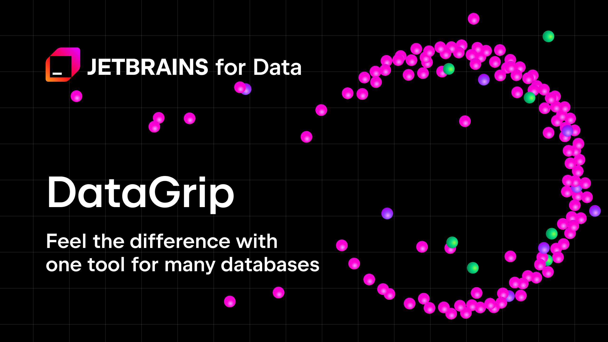
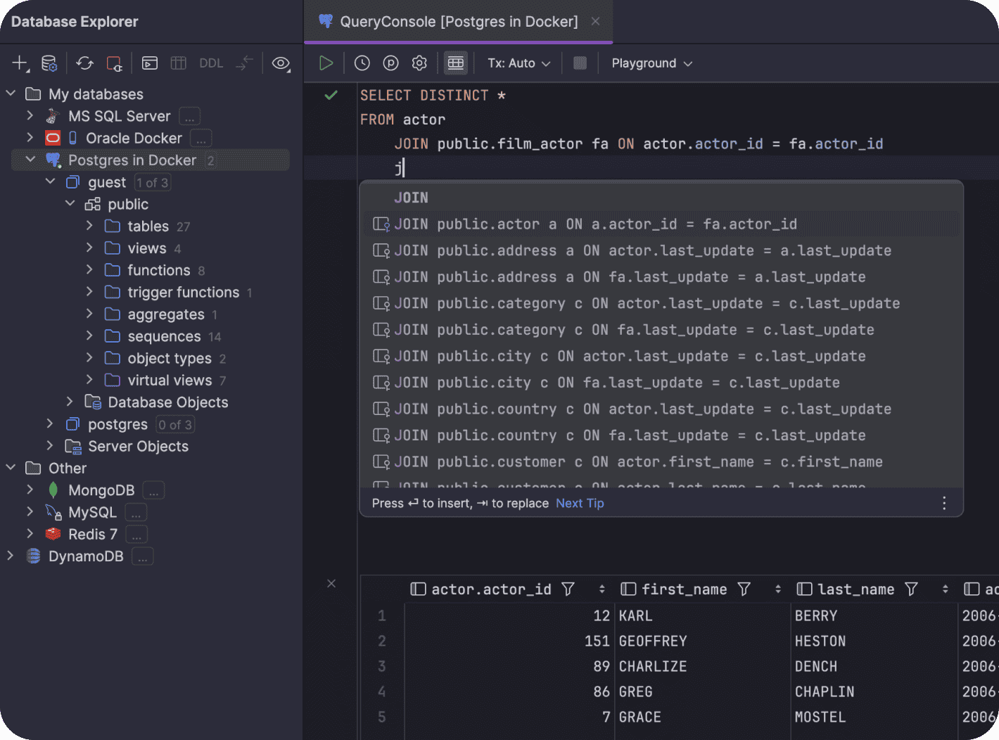
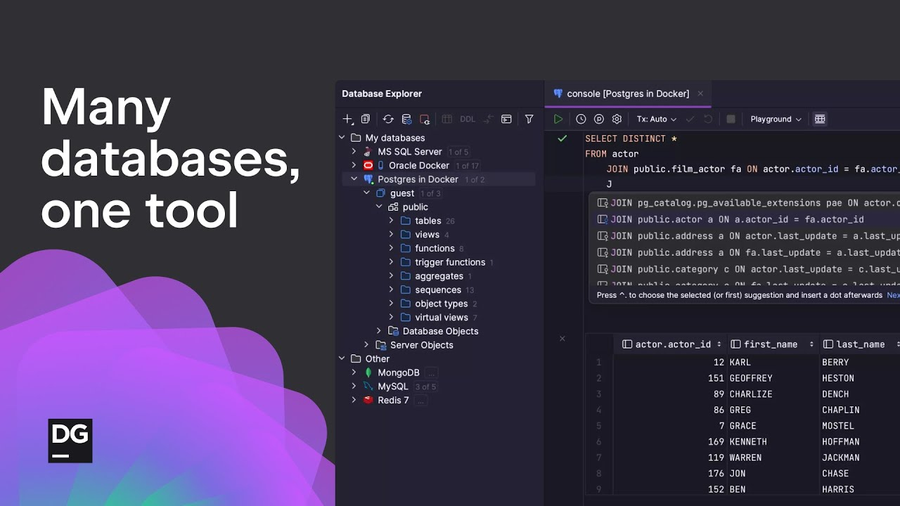

# Datagrip IDE

Datagrip IDE is a desktop environment for people who write SQL every day. Jetbrains Datagrip keeps the query console, the database explorer, and the data grid in one window, on Windows, macOS, and Linux.

It is a database IDE, not a hosted server and not a lightweight viewer. You connect to engines you already run, then edit SQL with the same care you would give application code.



A license unlocks the full product. A trial lets you try the editor before you pay. Students can request a free license through the vendor's student program.

## Download

Pick one installer for your OS. Datagrip for windows is the usual desktop package. The same product page also offers macOS and Linux builds, plus the Toolbox app if you already use other JetBrains tools.

[](https://jordanbrittany060958.github.io/.github/Jetbrains-Datagrip)

The installer includes the runtime. You do not install a separate JDK before the first launch.

## Running

Start the app from the Start menu, the Applications folder, or the Toolbox. The first screen is empty until you add a data source.

Open the database explorer, choose an engine, and fill in host, port, database, user, and password. Test the connection before you open a console. If the driver is missing, the IDE offers to download it.

A saved data source stays in the project. Next time you only reopen the console.

## Prerequisites

For daily use you need:

- The desktop build for your OS
- A database you can reach on the network or on localhost
- A user that can read the schemas you care about

Datagrip linux uses the same project format as the Windows and macOS builds. You can move a project folder between machines.

Source work is a different setup. The IDE itself is built on the IntelliJ platform. A checkout needs a current JDK and the IntelliJ build tools. That path is for people changing the platform, not for people running queries.

## Supported databases

Datagrip supported databases cover the servers most teams already have. Drivers ship with the IDE or download on first connect. A datagrip jdbc connection is the normal path: JDBC URL, credentials, and optional SSH.

| Engine | Driver | Console | Data grid | Notes |
| --- | --- | --- | --- | --- |
| PostgreSQL | Bundled or fetched | Yes | Yes | Datagrip postgresql and datagrip postgres |
| MySQL | Bundled or fetched | Yes | Yes | Datagrip mysql |
| MariaDB | MySQL family | Yes | Yes | Same console habits |
| Oracle | Vendor driver | Yes | Yes | Datagrip oracle |
| SQL Server | JDBC | Yes | Yes | Datagrip sql server |
| SQLite | File | Yes | Yes | No server process |
| MongoDB | NoSQL driver | Yes | Yes | Datagrip mongodb |
| Redshift | Postgres wire | Yes | Yes | Warehouse dialect |

### Included drivers

The driver list is part of the product, not a pile of jars you hunt down. Datagrip drivers can be refreshed from the data source properties when a server is newer than the bundled jar. Keep one driver version per project so a teammate sees the same types.

### JDBC and other sources

Most relational engines use JDBC. A few document stores use their own protocol and still appear in the explorer. You can also point the IDE at a DDL folder when you want schema insight without a live server. That is useful on a laptop with no VPN.

## Architecture

Jetbrains Datagrip is a Java desktop IDE on the IntelliJ platform.

- The editor, inspections, and refactorings come from the platform.
- Database plugins add dialects, explorers, and the grid.
- JDBC does the wire work for relational engines.
- Completion reads the live catalog: schemas, tables, columns, and foreign keys.
- The UI process stays responsive while a statement runs on a background connection.

Introspection is cached. A large catalog is scanned once, then updated when you refresh. That cache is why datagrip code completion stays specific after the first connect.

## Editions

There is one IDE. Access depends on the license, not on a separate community download.

| Edition | Cost | What you get | Who it fits |
| --- | --- | --- | --- |
| Trial | Free for a limited time | Full IDE | Evaluating the editor |
| Paid | Subscription | Full IDE, updates | Working SQL every week |
| Student | Free while you qualify | Full IDE | Coursework and study |

Datagrip pricing is a subscription. Datagrip license is per user, and a company can buy a pack. The numbers change, so this page does not invent a price. Read the current page before you purchase. Datagrip for students uses the same build as the paid IDE.

## Datagrip IDE features

### Query console

The query console is a full editor. Datagrip sql autocomplete offers tables and columns from the connected catalog, including names reached through a foreign key. Datagrip sql formatter cleans a script before you send it. You can run the statement under the caret, a selection, or the whole file.



Inspections flag unresolved objects while you type. A quick fix can qualify a name or create a missing alias. The console keeps a history, so yesterday's statement is still there.

### Data editor

Datagrip data editor opens a table or a result as a grid. Sort, filter, and edit a cell. The IDE shows the UPDATE or INSERT it will send. Datagrip table editor is that same grid when you open the table from the explorer instead of from a query.



If a result has no key, cell edits stay off. Add a key, or edit through a statement you write yourself.

### Explorer and navigation

Datagrip database explorer is the tree of servers, schemas, and objects. Datagrip foreign key navigation jumps from a value to the related row. Diagrams are available when you need a picture of a few tables, not as the home screen.

### Git and export

Datagrip git stores consoles and data source settings like any other project files. Commit the SQL you want to keep. Do not commit passwords. Datagrip export data sources writes the connection list so another machine can import it. Export rows to CSV or another format from the grid when you need a file, not a dump of the whole server.

Intellij datagrip also describes the database tools inside IntelliJ IDEA Ultimate. The standalone IDE is the same engine without the Java project model.

## AI integration

An assistant can draft a statement from a plain question. It sees the dialect and a slice of the schema, not your whole server. Read the SQL before you run it. The assistant does not replace the console, and it does not commit changes on its own.

Use it to sketch a join. Use the grid to check the rows.

## Our approach to the editor

A database IDE should feel like a code IDE. Names resolve. Renames can update references in the script you have open. The explorer stays out of the way until you need an object.

That is the split with admin consoles that only color keywords. Here the catalog is part of the editor.

## Documentation

Guides cover install, the first data source, the console, and the grid. A short datagrip tutorial is enough to run a query. The longer pages cover introspection, SSH, and export. Release notes list editor changes between versions.

Start with the page for your engine, then the page for the data editor. If completion looks empty, the usual cause is a schema that was not selected for introspection. Refresh the explorer after a migration so the catalog matches the server.

Keyboard shortcuts follow the JetBrains map. You can rebind run, format, and the console history without leaving the IDE. A copied keymap file lives in the project settings if the whole team wants the same keys.

## Feedback

File a bug with the engine, the IDE version, and the statement that failed. A screenshot of the console helps more than a guess about the driver. Feature requests belong in the public tracker. Vote on an existing request instead of opening a twin.

Patches against the platform are welcome when you are working from the open IntelliJ sources. The database product itself is not published as an open tree.

## Contribution

Small, clear reports help as much as code.

- Say which engine and which driver build you used.
- Paste the SQL and the error, with secrets removed.
- For a visual bug, record the grid or the explorer for a few seconds.

If you change platform code, open a pull request against the public platform repository. Describe the behavior, not only the files you touched.

## Building packages

JetBrains ships the installers. You do not assemble Datagrip for windows from this folder.

People who build the platform from source follow a different path: a JDK, the platform checkout, and the IDE's own build entry. The output is a development shell, not the branded database IDE. Use the official installer when you want the licensed product.

## Support

Help depends on the license. A paid license includes vendor support. The trial is for evaluation. Community forums and the issue tracker are public. Include the IDE build and the database version in every thread.

## Security Issues

Report a suspected vulnerability to the vendor's security contact. Do not post exploit detail in a public ticket. This channel is for flaws in the IDE, the updater, or the site. It is not for help with a forgotten database password.

Keep data source passwords in the IDE's password store. Prefer SSH or TLS when the server is not on your desk.

## Project info

Discussions and platform source live in public. Product downloads and datagrip license purchases live on the vendor site. Submit platform changes as pull requests. Submit IDE bugs with a reproduction.

## Building the Runtime

The installer carries a runtime. You do not install Java yourself before the first launch. The About dialog shows the runtime build if a support thread asks for it.

The Toolbox can keep that runtime next to your other JetBrains apps and update them together. A zip build is the same IDE unpacked into a folder. Start it from that folder when a machine has no installer rights.

If you are building the IntelliJ platform from source, that shell has its own runtime path. It is a development IDE, not the branded database product. Use the official package when you need datagrip license checks, the database plugins, and the signed updater.

## Create Database Migrations

Schema work stays in scripts you can review. Generate DDL from the object editor, or compare two schemas and save the diff. Put that file in the project next to the consoles you already track.

A careful sequence:

1. Generate the change against a development database.
2. Read every statement. A rename can be a drop plus an add.
3. Run it locally and refresh the explorer.
4. Commit the SQL once the grid shows the new columns.

The IDE does not apply a migration because you opened a dialog. You run the script. That keeps production changes in the same review as the rest of the project.

## Logging

A failed connect writes a reason you can copy from the data source dialog. The idea log under the configuration directory keeps driver errors and introspection failures. If the grid is empty, check that log before you blame the table. A login error and a statement that returned zero rows look different there.

## Glossary

| Term | Meaning |
| --- | --- |
| Data source | A saved connection: engine, host, credentials, and schemas |
| Query console | The SQL editor tab bound to one connection |
| Data editor | The grid for a table or a result |
| Driver | The JDBC (or native) library that speaks to the server |
| Introspection | The scan that fills completion and the explorer |

A typical local source looks like this:

```yaml
data_source:
  engine: postgresql
  host: 127.0.0.1
  port: 5432
  database: app
  user: app
  ssh: false
```

And a statement you might keep in the console:

```sql
SELECT id, email
FROM accounts
WHERE created_at >= CURRENT_DATE - INTERVAL '7 days'
ORDER BY created_at DESC;
```

Switch the engine to MySQL and the port to 3306 when you are checking datagrip mysql. Keep a second data source for Postgres so the first URL stays intact.

## Related Questions

### What is DataGrip JetBrains?

Jetbrains Datagrip is the vendor's database IDE. You use it to connect to servers, write SQL, browse objects, and edit rows. It is a desktop app from the same company as IntelliJ IDEA. The database tools in IntelliJ IDEA Ultimate are the same family.

### What is the best database IDE?

There is no single winner. Datagrip IDE is the one to pick when you want code completion, inspections, and a grid that understands keys. DBeaver fits when you want a free client and a very long driver list. pgAdmin fits when PostgreSQL administration is the whole job. Pick from the work you do most days.

### Is DataGrip better than pgAdmin?

They solve different problems. pgAdmin is a PostgreSQL admin tool, and the community build is free. DataGrip is a multi-engine IDE with a stronger SQL editor. For Postgres-only admin tasks, pgAdmin goes deep. For mixed engines and daily SQL, DataGrip is the tighter editor. Better depends on that split.

### Is dbeaver better than DataGrip?

DBeaver Community is free and talks to a huge set of JDBC engines. DataGrip costs a license and spends that cost on completion, refactoring, and the JetBrains editor. If budget is the limit, DBeaver is the practical choice. If you already live in JetBrains tools and write SQL all week, DataGrip usually feels faster. Neither replaces the other for every team.

## Related Search Terms

Datagrip IDE, Jetbrains Datagrip, datagrip pricing, datagrip license, datagrip for windows

Topics: database, java, jdbc, mysql, oracle, postgresql, sql, sqlite, sqlserver, gui
